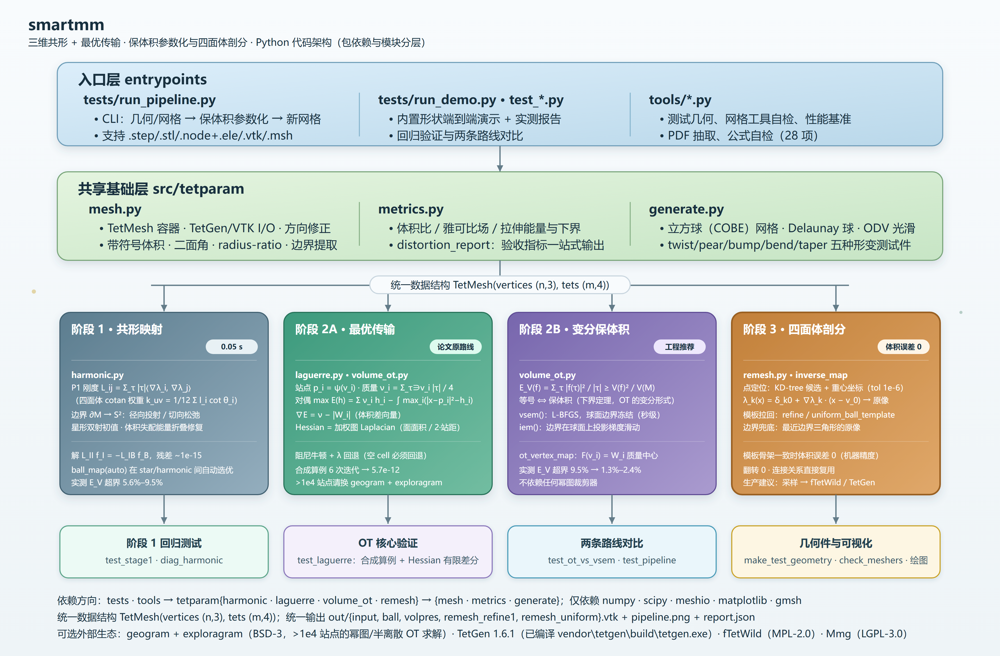
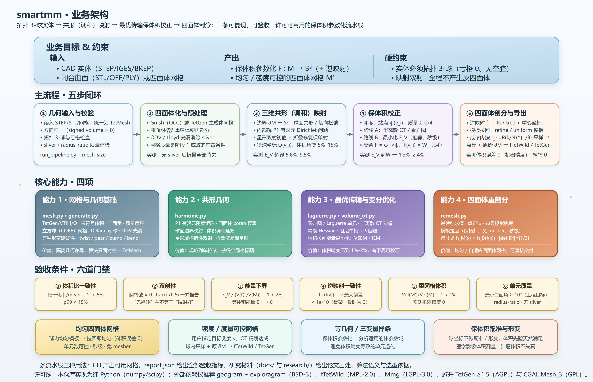

# 三维共形 + 最优传输做四面体剖分 —— 参考实现

目标论文：**Volume preserving mesh parameterization based on optimal mass transportation**
(Su, Chen, Lei, Zhang, Qian, Gu; *Computer-Aided Design* **82**:42–56, 2017; DOI [10.1016/j.cad.2016.05.020](https://doi.org/10.1016/j.cad.2016.05.020))

📄 **主文档：[docs/三维共形-最优传输-四面体剖分-全流程.md](docs/三维共形-最优传输-四面体剖分-全流程.md)**
（论文定位与获取、被验证的算法语义、四个阶段的完整数学与工程细节、工具许可清单、失效模式、验收指标）

## 架构图

| 代码架构（包依赖与模块分层） | 业务架构（主流程 · 能力 · 验收门禁） |
|---|---|
| [](docs/architecture-code.svg) | [](docs/architecture-business.svg) |

SVG 与 PNG（3840 px 宽，2× 渲染）都在 `docs/` 下。改完 SVG 后用
`pwsh -File tools\render_diagrams.ps1` 重新生成 PNG（走本机 Chrome/Edge 无头渲染）。

## 快速开始

```powershell
$py = 'C:\Users\panyi\.dsh\dsh-runtimes\dsh-primary-runtime\dependencies\python\python.exe'
$env:PYTHONPATH = 'E:\panyingyun\smartmm\src'
cd E:\panyingyun\smartmm
```

### 跑自己的几何/网格（推荐入口）

```powershell
# ① CAD 实体（STEP/IGES/BREP）：先用 Gmsh 四面体化，再跑全流程
& $py tests\run_pipeline.py 你的模型.step --mesh-size 0.02 --out out\my_part

# ② 闭合曲面网格（STL/OFF/PLY/OBJ）：Gmsh 重建体积后四面体化
& $py tests\run_pipeline.py 你的模型.stl  --mesh-size 0.05 --out out\my_part

# ③ 已经是四面体网格：TetGen 原生格式
& $py tests\run_pipeline.py part.node --ele part.ele --out out\my_part

# ④ 已经是四面体网格：VTK / VTU / Medit / Gmsh .msh
& $py tests\run_pipeline.py part.vtk --out out\my_part
```

**输入**：`.node`(+`.ele`) / `.vtk` / `.vtu` / `.msh` / `.mesh`，或 `.step` `.iges` `.brep` `.stl` `.off` `.ply` `.obj`。
**要求**：实体必须是**拓扑 3-球**（可定向、连通、边界亏格 0、无内部空腔）。
**输出**（默认 `out\pipeline_<名字>\`）：`input.vtk`、`ball.vtk`（阶段 1）、`volpres.vtk`（阶段 2）、`remesh_refine1.vtk` / `remesh_uniform.vtk`（阶段 3 新网格）、`pipeline.png`（畸变图）、`report.json`（全部指标）。

### 跑内置演示与验证

```powershell
& $py tests\run_demo.py                    # 球/梨/锥/弯/扭/鼓包 -> out/ （图 + report.json）
& $py tests\test_laguerre.py               # 半离散 OT 求解器验证（合成算例 + Hessian 有限差分）
& $py tests\test_pipeline.py               # 阶段 1 + 2 全流程
& $py tests\test_ot_vs_vsem.py             # OT 复合 F=φ⁻¹∘ψ  vs  体积拉伸能量最小化
& $py tools\check_meshers.py               # 检查本机可用的网格工具
& $py tools\make_test_geometry.py          # 造一个测试几何（out/geomtest/）
```

依赖 `numpy` / `scipy` / `meshio` / `matplotlib`（四面体化几何时另需 `gmsh`），**无需编译**。

## 流水线

| 阶段 | 模块 | 做什么 |
|---|---|---|
| 0 | `mesh.py`, `generate.py` | 四面体网格 I/O（TetGen/VTK）、方向与质量检查、立方球测试网格、ODV 光滑 |
| 1 「共形」 | `harmonic.py` | P1 有限元刚度矩阵、球面边界映射、体积调和延拓、星形域构造性双射初值、折叠修复、无折叠松弛 |
| 2A 「最优传输」 | `laguerre.py`, `volume_ot.py` | 乘方图 / Laguerre 单元、半离散 OT 对偶 + 精确 Hessian + 阻尼牛顿、`F(v_i)=W_i` 质量中心 |
| 2B 「等价变分形式」 | `volume_ot.py` | 体积拉伸能量最小化（VSEM / L-BFGS）、球面自由边界（IEM） |
| 3 「剖分」 | `remesh.py` | 逆映射求值（KD-tree + 重心坐标）、模板拉回重网格化、均匀球模板、均匀细分、尺寸场 |
| 验收 | `metrics.py` | 体积比分布、雅可比场、拉伸能量与下界、等体积能量 |

## 实测效果（立方球网格 n=6：343 顶点 / 1296 四面体）

| 形状 | 阶段 1 `E_V` 超界 | 阶段 2 (VSEM) 超界 | 翻转 | 模板拉回体积误差 |
|---|---|---|---|---|
| 球（平凡） | 0.0000% | 0.0000% | 0 | −2.2e−16 |
| 扭转 | 0.0000% | 0.0000% | 0 | — |
| 梨形 | 5.573% | **1.362%** | 0 | 0（机器精度） |
| 锥形 | 8.368% | **1.304%** | 0 | −3.3e−16 |
| 弯曲 | 7.942% | **1.669%** | 0 | 0（8 个翻转继承自阶段 1） |
| 鼓包 | 9.529% | **2.393%** | 0 | — |

## 目录

```
docs/        主技术文档
src/tetparam/ 参考实现
tests/       演示与验证脚本（run_pipeline.py 是面向自己几何的 CLI）
tools/       辅助脚本（几何测试件、网格工具自检、PDF 抽取、调研基准）
research/    四份深度调研（论文算法 / OT 工具链 / 球参数化 / 四面体网格化）
refs/        下载的论文全文抽取、作者发布的代码与测试数据
vendor/      geogram、exploragram、TetGen 等（TetGen 1.6.1 已编译：
             vendor\tetgen\build\tetgen.exe）
out/         运行输出
```

## 三条最重要的工程结论

1. **「共形 + 最优传输」与「最小化体积拉伸能量」是同一个问题的两种写法。**
   OT 的对偶就是容量约束 Voronoi / 乘方图的变分问题；而 `E_V(f)=Σ|f(τ)|²/|τ|` 的下界当且仅当保体积时取到。**生产上不必显式解 OT**，直接最小化 `E_V`（VSEM）即可，秒级、无需幂图裁剪器。

2. **论文的复合规则已被作者自己发布的数据验证。**
   站点 = **网格顶点的调和像**（不是四面体质心），质量 = `Σ_{τ∋v_i}|τ|/4`（重心对偶体积，实测相对误差 5.6e−8），复合 `F = φ⁻¹∘ψ`，`F(v_i) = W_i` 的**质量中心**。

3. **超过约 1e4 个站点就必须用 C++ 的 geogram + exploragram**（都是 BSD-3-Clause，可商用）。
   纯 Python 实现（本仓库 `laguerre.py`）核心算法已验证正确（Hessian 有限差分相关度 −1.000000，合成算例收敛到 5.7e−12），但在网格规模下的鲁棒性不足（多层初始化 + 球面边界薄壳 cell）。
